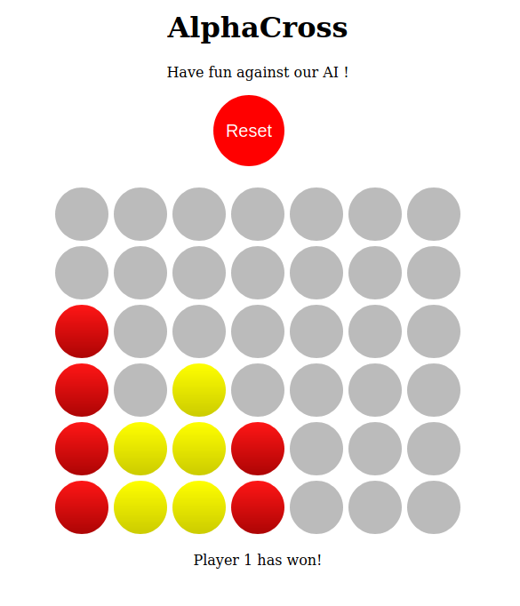

AlphaCross
==============================

### What is this project ?

This is a collaborative project to build an AI playing board games with super human performances. It is currently under
development by [AnOtterGithubUser](https://github.com/AnOtterGithubUser) and [desrousseaux](https://github.com/desrousseaux).  
We do not necessarily aim to produce a state of the art AI (although it would be nice !). This project is mostly to explore RL (Reinforcement Learning) and 
deep RL and its applications to board games and to develop our coding skills. That is why you won't find many high level libraries in the requirements (specific to RL we mean). 
The idea is to develop an agent and environment, possibly several, from scratch (well we still use keras, numpy, and all the good stuff).

### How is the project structured ?

The most important part of the project is in the *src/* directory whose structure is as follows:

    ├──src
       ├──main
          ├──environment
              ├──__init__.py
              ├──_environment.py <- Implements the abstract interface for environments
              ├──cross_game.py <- Implements the specifics of the cross game environment
              ├──errors.py
           ├──models
              ├──__init__.py
              ├──agent.py <- Implements the abstract interface for agents
              ├──dqn_agent.py <- Implements the specifics of the DQN Agent
           ├──__init__.py
           ├──constants.py
       ├──test
          ├──__init__.py
          ├──test_cross_game.py <- I loooove unit tests, and TDD (#TDDForever)
       ├──__init__.py
       ├──play_against_ai.py <- Play against a pre-trained model
       ├──play_against_human.py <- Play against another human (or with yourself)
       ├──train_model.py <- Defines the command line to train the model with its parameters

You'll find that the *environment* has a similar API to [gym](https://gym.openai.com). As said in the first part we chose not to use 
high level libraries such as gym so the ressemblance is unvoluntary and kinda funny (but shows that it is pretty intuitive).

### How does this work ?

We decided to use a DQN (Deep Q-Network) as described in [Mnih, Kavukcuoglu et al. NIPS 2013](https://deepmind.com/research/publications/playing-atari-deep-reinforcement-learning). This approach developed by DeepMind technologies 
was one of the first applications of reinforcement learning in high dimensional environments. A DNN (Deep Neural Network) is used to tackle the high dimensionality challenge.  
In Reinforcement Learning there is an environment with states *s*, actions *a* that lead from one state to another and rewards *r* for reaching states. An agent is placed in the environment with no prior knowledge of it 
and has to maximize its reward by following the best course of actions.  In our case we use **Q-learning**.  
Basically, Q-learning aims at learning a function Q*: s x a -> Q*(s, a) which is defined as the maximum expected reward by taking action *a* while in state *s*. Q* is called the optimal action-state value function. 
Hence, we are trying to learn a policy *p* that maps a state *s* to the action that maximizes the expected reward from *s*: p(s) = a* where a*=argmax_a Q*(s, a). 
Intuitively, by applying *p*, we are following the path with highest expected reward.  
This part is quite technical, if you are interested in Reinforcement Learning read [this introduction from Sutton](http://incompleteideas.net/book/the-book-2nd.html).  
In high dimensional environments you have way too many possible states for your agent. Thus we use a DNN that takes the state as input 
and outputs an action. Please read the article for more details.  

### Run the application in browser

You can run the connect four environment in your browser. Go to the project root and run: 
`python run_webapp.py`. This will start a Flask server on your localhost and will give you the adress 
where it is running.  
  
*Alphacross screenshot*

For now you can only play against yourself. It will soon be possible to play against our trained model.

### This looks great ! how can I contribute ?

We appreciate your enthusiasm ! This is a work in progress and the project is far from being ready for that. It is still under active 
development and things might change very much and very fast. However if you have questions we would be happy to hear from you. We do not yet have an 
adress for you to contact us but it will come soon so check this repo for updates !  

Thanks for reading this far, here's a :cookie:  

AnOtterGithubUser & desrousseaux  
  
    
      

Project based on the <a target="_blank" href="https://drivendata.github.io/cookiecutter-data-science/">cookiecutter data science project template</a>. #cookiecutterdatascience

